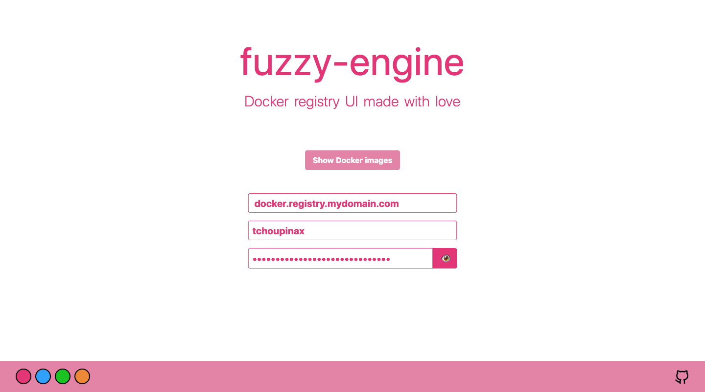
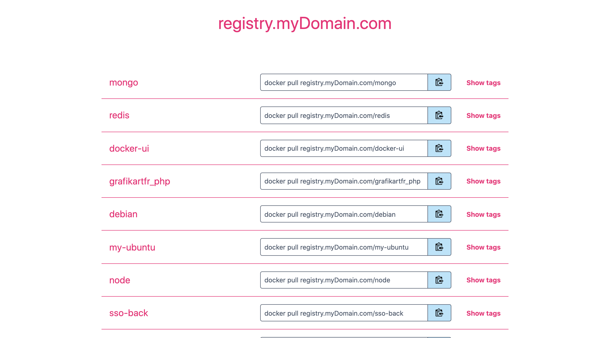

# fuzzy-engine 🐳

Fuzzy engine a is beautiful ✨ and simple 🐹 UI for your private Docker registry.

demo: https://fuzzy-engine.corentinfiloche.xyz

## Getting started

The best way to use and to deploy the UI is with Docker.

```
docker run -d -p 3000:3000 tchoupinax/fuzzy-engine
```

### Environment variables

| Syntax                   | Description                                 |
| ------------------------ | ------------------------------------------- |
| DOCKER_REGISTRY_URL      | Specify the url to access the registry      |
| DOCKER_REGISTRY_USERNAME | Specify the username to access the registry |
| DOCKER_REGISTRY_PASSWORD | Specify the password to access the registry |


Environment variable can be passed to the container with `-e` option 

```
docker run -d \
  -e DOCKER_REGISTRY_URL=registry.mydomain.com \
  -p 3000:3000 
  tchoupinax/fuzzy-engine
```

### Screenshots 🖼

Home page



List of your repositories



List of the digests (with tags) for one repository


### Roadmap

* [ ] Possibility to color tag (matching a regex)
* [ ] Add size and date data (on repository and tags views)
* [ ] Add footer and github link on app
* [x] Add title and favicon

#### Built with

* [Nuxt.js](https://nuxtjs.org/) - Vue.js framework
* [Tailwindcss](https://tailwindcss.com/) - Utility-first CSS framework
