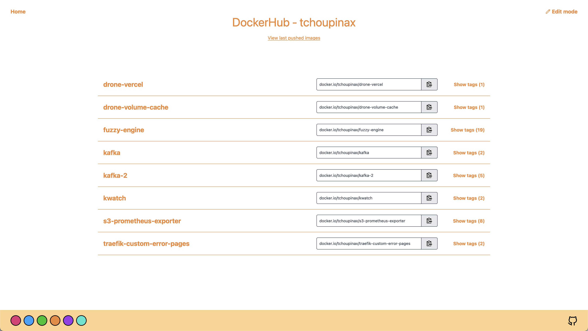

# fuzzy-engine 🐳

Fuzzy engine a is beautiful ✨ and simple 🐹 UI for your [private Docker registry](https://hub.docker.com/_/registry) or another registries.

List of supporting docker registry:

- [x] Self hostable registry
- [x] AWS ECR
  - [x] With API keys
  - [x] With local authentication (CLI)
- [x] Github Container Registry
- [x] Dockerhub
- [ ] Google Cloud

**demo**: https://fuzzy-engine.corentinfiloche.xyz

## Getting started

The best way to use and to deploy the UI is with Docker.

```
docker run -d -p 3000:3000 tchoupinax/fuzzy-engine
```

### Authentication to ECR using AWS local authentication

In a company enterprise, you are logged to your ECR with the AWS cli. Fuzzy-engine support this authentication.

When you logged in, the cli exposed three environment variables to your shell
- AWS_ACCESS_KEY_ID
- AWS_SECRET_ACCESS_KEY
- AWS_SESSION_TOKEN

Fuzzy-engine will simply use them for talking with AWS api.

If you use a Docker image, you have to share these variable by the following way

```
docker run -d \
  -p 3000:3000 \
  -e AWS_ACCESS_KEY_ID=$AWS_ACCESS_KEY_ID \
  -e AWS_SECRET_ACCESS_KEY=$AWS_SECRET_ACCESS_KEY \
  -e AWS_SESSION_TOKEN=$AWS_SESSION_TOKEN \
  tchoupinax/fuzzy-engine
```

### FAQ

#### How it works ?

You set your credentials with the form on the home page. Then, they are kept in a cookie. **Not elsewhere**. These credentials are used to request your registry.

#### Why this is not an SPA ?

The docker registy [image](https://hub.docker.com/_/registry) does not allow cross-origin request, so browser prevents from making the requests. The only solution is to make requests backend side.

### Screenshots 🖼

Home page


List of your repositories



List of the digests (with tags) for one repository


#### Built with

* [Nuxt.js 3](https://nuxtjs.org/) - Vue.js framework
* [Tailwindcss](https://tailwindcss.com/) - Utility-first CSS framework

## Docker informations

### Trigger the garbage collector

```bash
docker exec -it container-name bin/registry garbage-collect /etc/docker/registry/config.yml
```
