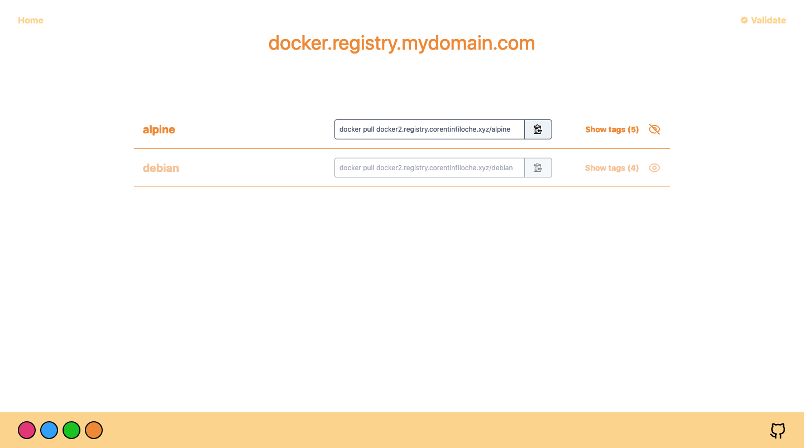

# fuzzy-engine 🐳

Fuzzy engine a is beautiful ✨ and simple 🐹 UI for your [private Docker registry](https://hub.docker.com/_/registry) or another registries.

List of supporting docker registry:

- [x] self-hostable registry
- [x] AWS ECR
- [ ] Google Cloud

**demo**: https://fuzzy-engine.corentinfiloche.xyz

## Getting started

The best way to use and to deploy the UI is with Docker.

```
docker run -d -p 3000:3000 tchoupinax/fuzzy-engine
```

### Environment variables

| Syntax                   | Description                                 |
| ------------------------ | ------------------------------------------- |
| DOCKER_REGISTRY_URL      | Specify the url to access the registry      |
| DOCKER_REGISTRY_USERNAME | Specify the username to access the registry |
| DOCKER_REGISTRY_PASSWORD | Specify the password to access the registry |
Environment variable can be passed to the container with `-e` option 

```
docker run -d \
  -e DOCKER_REGISTRY_URL=registry.mydomain.com \
  -p 3000:3000 
  tchoupinax/fuzzy-engine
```

### FAQ

#### How it works ?

You set your credentials with the form on the home page. Then, they are kept in a cookie. Not elsewhere. These credentials are used to request your registry. You can set your credentials from environment variables. When a credential is setted from environment, it could not be rewrited by user. Each credential is independant.

#### Why this is not an SPA ?

The docker registy [image](https://hub.docker.com/_/registry) does not allow cross-origin request, so browser prevents from making the requests. The only solution is to make requests backend side.

### Screenshots 🖼

Home page


List of your repositories



List of the digests (with tags) for one repository


### Roadmap

* [x] List tags and regroup them for the same digest
* [x] Be able to delete a digest
* [x] Add size and date data (on repository and tags views)
* [x] Add footer and github link on app
* [x] Add title and favicon
* [x] Improve navigation (with buttons)
* [x] Sort tag by created date
* [ ] Possibility to color tag (matching a regex)
* [x] Hide repository on the repository list

#### Built with

* [Nuxt.js](https://nuxtjs.org/) - Vue.js framework
* [Tailwindcss](https://tailwindcss.com/) - Utility-first CSS framework

## Docker informations

### Trigger the garbage collector

```bash
docker exec -it container-name bin/registry garbage-collect /etc/docker/registry/config.yml
```
